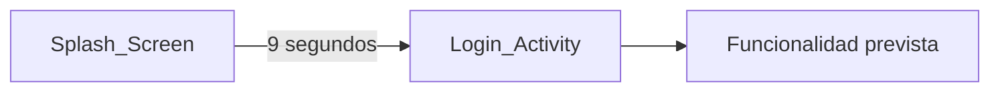

# Anglarill Fitness

<p align="center">
  
</p>

**Anglarill-Fitness** es una aplicación Android de nutrición personal. Su objetivo es ayudar a controlar el peso, registrar calorías y nutrientes, seguir hábitos saludables y recibir recomendaciones de comidas, con integración prevista con dispositivos de fitness.

**Estado:** prototipo inicial / en desarrollo.

**Demo visual:** abre [`docs/index.html`](docs/index.html) en el navegador para recorrer la app completa con datos de demostración. Es un prototipo web, no la aplicación Android.

En local también puedes servir la carpeta:

```bash
python -m http.server 8765 --directory docs
```

Luego entra en `http://localhost:8765`.

---

## ¿Qué es este proyecto?

Anglarill Fitness es un producto de bienestar para **usuarios finales** (B2C): personas que quieren gestionar su nutrición y su progreso desde el móvil.

No es un gimnasio, ni una app de reservas, ni un sistema de pagos o de gestión para entrenadores.

La interfaz y la documentación están pensadas en **español**.

---

## Visión y características previstas

Estas funciones describen el **roadmap** del producto. Aún no están implementadas en el código.

- Control de peso y seguimiento del progreso
- Registro de consumo de calorías y nutrientes
- Recomendaciones de comidas y planes de comidas personalizados
- Recordatorios y seguimiento de hábitos saludables
- Integración con dispositivos de fitness y seguimiento de actividad física

---

## Estado actual

Hoy el repositorio es un **esqueleto Android** con identidad visual y el arranque de la app. La visión del producto se puede explorar en la [demo web de `docs/`](docs/index.html) (HTML/CSS/JS, datos hardcodeados).

**Implementado**

- Pantalla de bienvenida (`Splash_Screen`) con logo y paleta de marca (verde lima `#8bc200`, teal `#00574B`)
- Navegación automática al login tras 9 segundos
- Activity de acceso (`Login_Activity`) sin formulario ni lógica de autenticación

**Aún no implementado**

- Firebase (auth y base de datos)
- Arquitectura MVP completa (solo existe la carpeta `Vista`)
- Modelos de datos, tracking de peso/calorías, planes de comidas, hábitos o wearables



---

## Stack tecnológico

| Área | Tecnología |
|------|------------|
| Plataforma | Android nativo (Java) |
| UI | Android Support Library (sin AndroidX): AppCompat, ConstraintLayout, CardView |
| Build | Gradle 5.1.1, Android Gradle Plugin 3.4.1 |
| SDK | `minSdk` 21 (Android 5.0), `compileSdk` / `targetSdk` 28 |
| Identificador | `com.anglarill_fitness.anglarill_fitness` |
| Arquitectura prevista | MVP (Modelo-Vista-Presentador) + Firebase |

Firebase y las capas Modelo/Presentador **no están** en [`app/build.gradle`](app/build.gradle) ni en el código. No hace falta `google-services.json` para compilar el prototipo actual.

---

## Cómo ejecutarlo en local

### Requisitos

- Android Studio
- JDK 8
- Android SDK con API 28
- Dispositivo o emulador con Android 5.0 o superior

> **Aviso:** el proyecto usa `jcenter()`, que está deprecado. En entornos nuevos el build puede fallar hasta migrar los repositorios.

### Pasos

1. Clonar el repositorio.
2. Abrir la carpeta del proyecto en Android Studio.
3. Dejar que Gradle sincronice las dependencias (`local.properties` se genera al abrir el proyecto).
4. Ejecutar la app en un emulador o dispositivo (`Run`).

### Comando opcional

```bash
./gradlew assembleDebug
```

---

## Estructura del repositorio

```
AnglarillFitness/
├── app/
│   └── src/main/
│       ├── java/.../Vista/     # Splash_Screen, Login_Activity
│       ├── res/                # layouts, colores, logo e iconos
│       └── AndroidManifest.xml
├── docs/                       # Demo web (prototipo visual)
├── gradle/                     # Gradle Wrapper
├── build.gradle
└── README.md
```

El módulo principal es `app/`. Las pantallas viven en el paquete `Vista`. Layouts, logo e iconos están en `app/src/main/res/`.

---

## Contribuir

1. Hacer un fork del repositorio.
2. Crear una rama (`git checkout -b feature/nueva-caracteristica`).
3. Hacer commit de los cambios.
4. Hacer push de la rama (`git push origin feature/nueva-caracteristica`).
5. Abrir un pull request.

---

## Contacto

joseca6520@gmail.com
