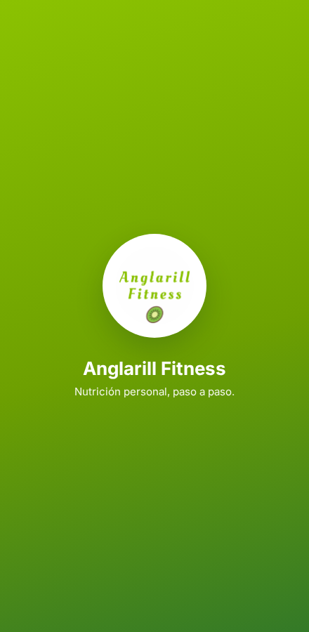
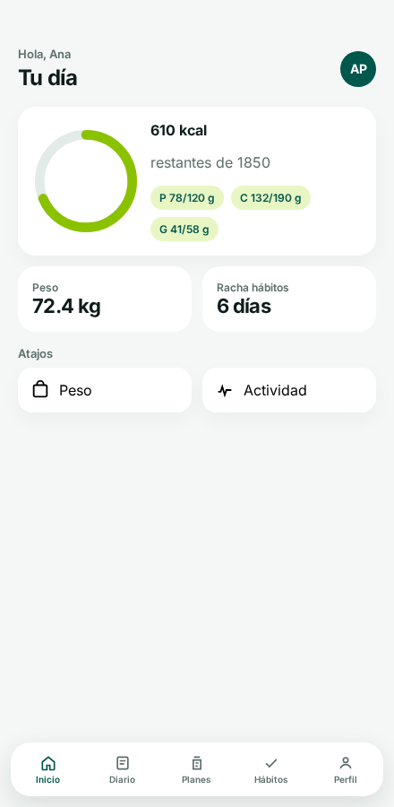
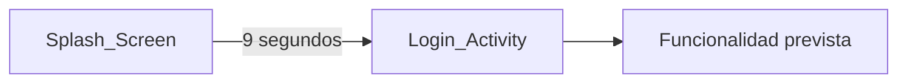

# Anglarill Fitness

Aplicación Android de nutrición personal para **usuarios finales** (B2C) en Bolivia: control de peso, calorías, hábitos y recomendaciones de comidas. Este repositorio es un **prototipo** (esqueleto nativo + demo web); no es el producto en producción.

<p align="center">
  
</p>

<p align="center">
  
  
</p>

**Estado:** prototipo visual / en desarrollo.  
**Demo web:** [`docs/index.html`](docs/index.html) (HTML/CSS/JS con datos de demostración; no es la APK).

```bash
python -m http.server 8765 --directory docs
```

Abre [http://localhost:8765](http://localhost:8765).

---

## El problema

Quien sigue una dieta suele repartir el registro entre notas, calculadoras y el reloj. Anglarill Fitness concentra peso, calorías, planes y hábitos en el móvil, con identidad visual propia (verde lima `#8bc200`, teal `#00574B`) y la interfaz en **español**.

No es un gimnasio, ni reservas, ni un panel para entrenadores.

---

## Qué se puede ver hoy

| Área | Hoy |
|------|-----|
| Demo web (`docs/`) | Recorrido completo con datos inventados (inicio, diario, planes, hábitos, perfil) |
| App Android | Splash con logo y paleta; login sin formulario ni autenticación |
| Firebase, modelos, tracking, wearables | No implementado en este código |

La visión de producto (peso, calorías, planes, hábitos, wearables) está en la demo web, **no** en el módulo Android.



---

## Cómo probarlo (2 minutos)

1. Abre [`docs/index.html`](docs/index.html) o sirve `docs/` como arriba.
2. Entra con cualquier email y contraseña (solo la demo).
3. Recorre Inicio, Diario, Planes, Hábitos y Perfil.

Para la APK de prototipo: Android Studio → Run, o `./gradlew assembleDebug`.

---

## Qué hice yo

- Identidad visual y arranque de la app Android (splash y pantalla de acceso).
- Prototipo web en `docs/` para mostrar el producto previsto con datos de demostración.

---

## Stack

| Área | Tecnología |
|------|------------|
| Plataforma | Android nativo (Java) |
| UI | Android Support Library (sin AndroidX): AppCompat, ConstraintLayout, CardView |
| Build | Gradle 5.1.1, Android Gradle Plugin 3.4.1 |
| SDK | `minSdk` 21, `compileSdk` / `targetSdk` 28 |
| Identificador | `com.anglarill_fitness.anglarill_fitness` |
| Demo | HTML/CSS/JS en `docs/` |
| Arquitectura prevista | MVP + Firebase (aún no está en el código ni en `app/build.gradle`) |

---

## Instalación de la app Android

**Requisitos:** Android Studio, JDK 8, Android SDK API 28, dispositivo o emulador con Android 5.0+.

El proyecto usa `jcenter()`, deprecado: en entornos nuevos el build puede fallar hasta migrar los repositorios.

1. Clonar el repositorio y abrirlo en Android Studio.
2. Esperar a que Gradle sincronice (`local.properties` se genera al abrir el proyecto).
3. Ejecutar en un emulador o dispositivo.

```bash
./gradlew assembleDebug
```

---

## Estructura del repositorio

```
AnglarillFitness/
├── app/src/main/java/.../Vista/   # Splash_Screen, Login_Activity
├── app/src/main/res/              # layouts, colores, logo
├── docs/                          # Demo web
│   └── screenshots/               # Capturas de la demo
├── gradle/
└── README.md
```

---

José Carlo Suárez Brucsoni · [joseca6520@gmail.com](mailto:joseca6520@gmail.com)

Uso personal y académico, salvo acuerdo distinto con el titular de la marca.
